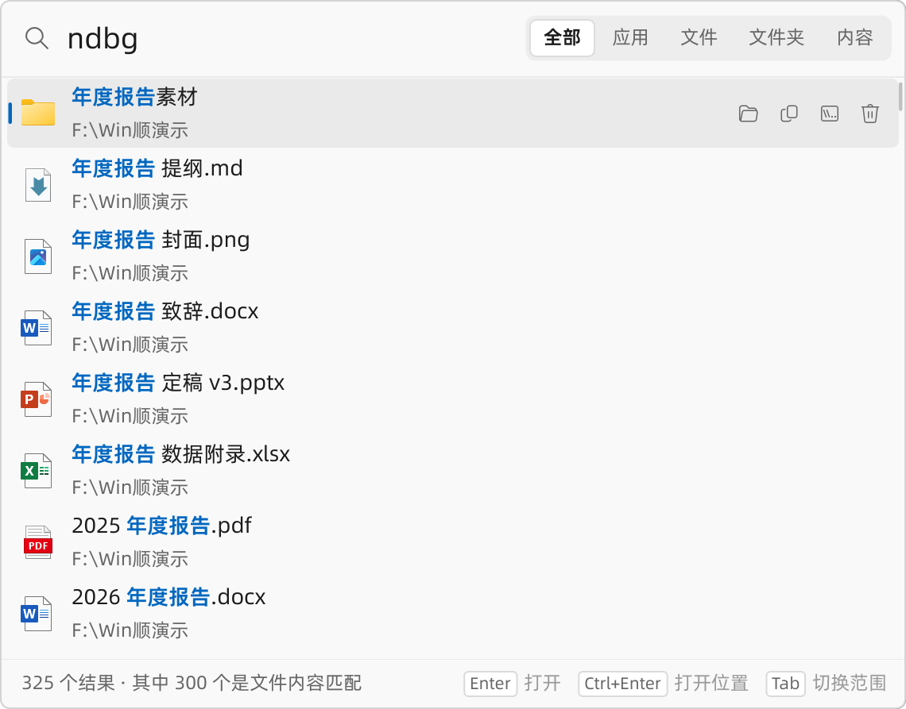
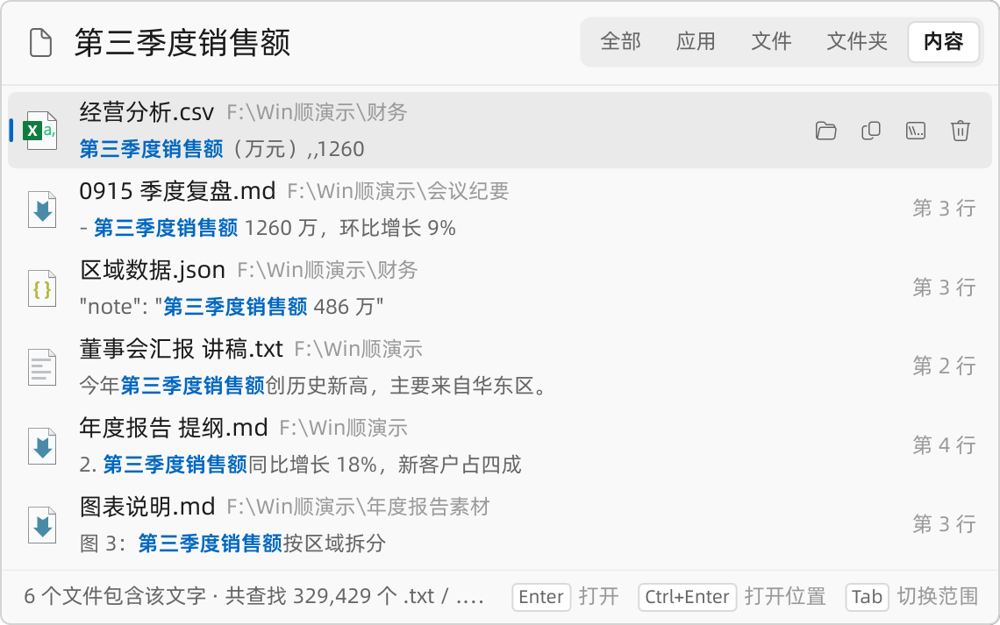
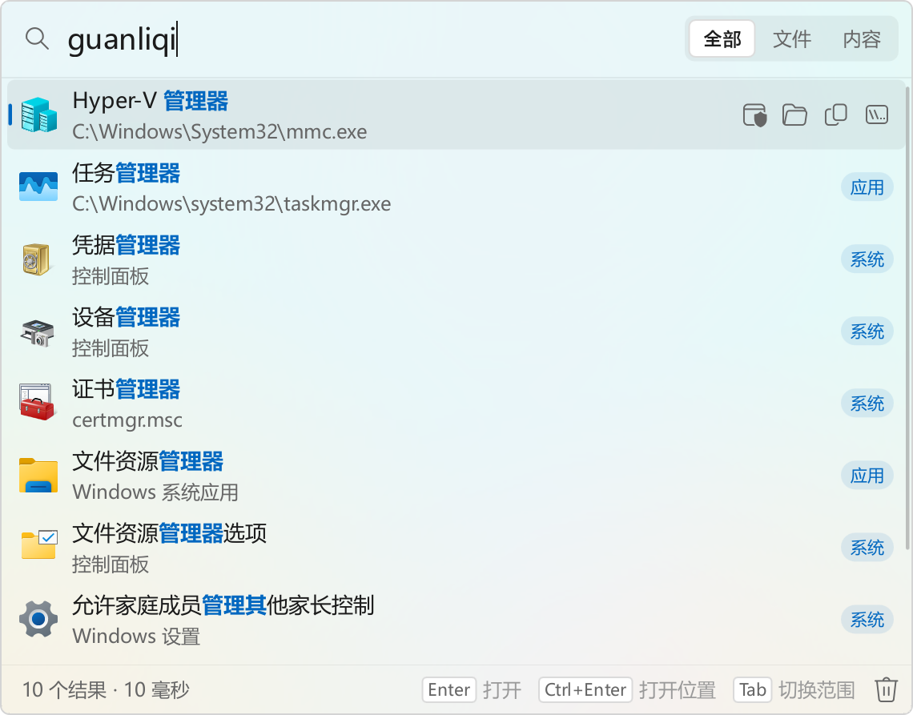
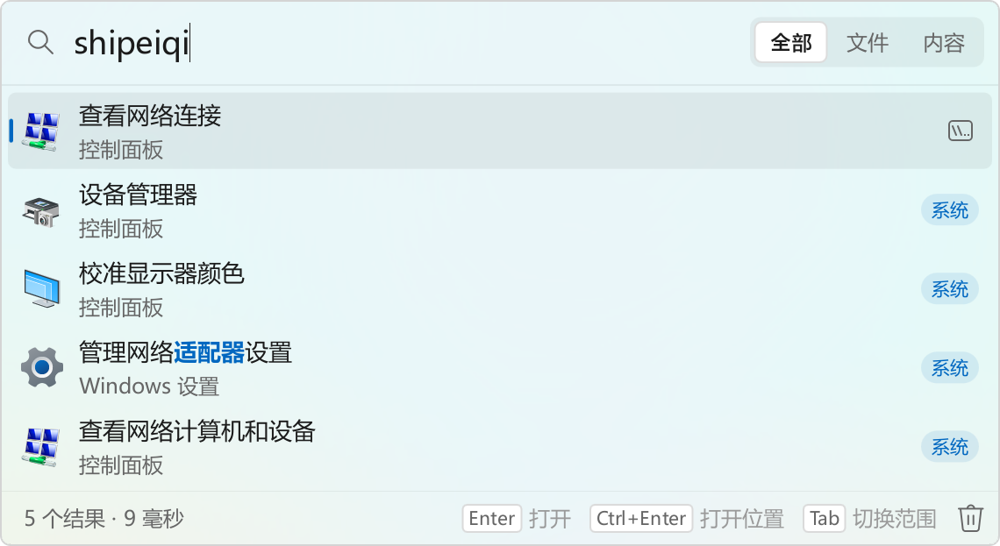
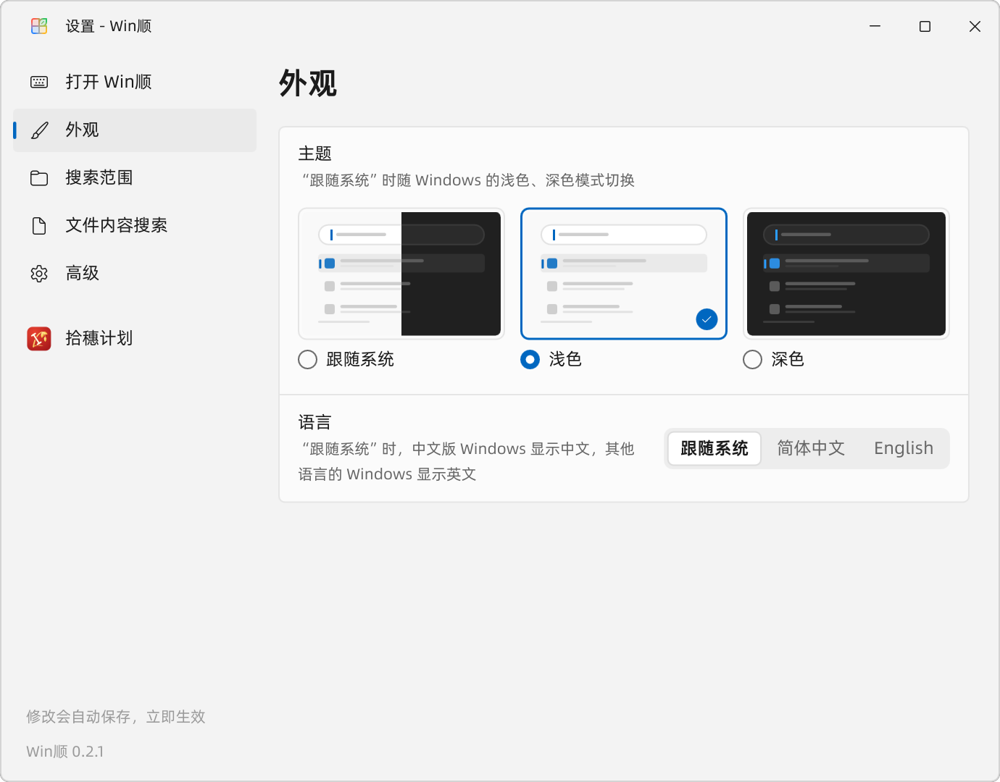

<p align="center">
  
</p>

<h1 align="center">Win顺 · WinShun</h1>

<p align="center">
  <b>双击 Ctrl，搜遍整台电脑</b> —— 免费开源的 Windows 快速搜索启动器<br>
  <b>Press Ctrl twice, search your whole PC</b> — a free, open-source search launcher for Windows
</p>

<p align="center">
  <a href="https://github.com/LingCore/WinShun/releases/latest"></a>
  
  
  <a href="LICENSE"></a>
  <a href="https://linux.do"></a>
</p>

<p align="center">
  <a href="#中文">中文</a> · <a href="#english">English</a>
</p>

<p align="center">
  <picture>
    <source media="(prefers-color-scheme: dark)" srcset="docs/images/search-dark.png">
    
  </picture>
</p>

---

<a id="中文"></a>

## 中文

**Win顺 是什么？** 一个 Windows 上的快速搜索启动器。连按两下 Ctrl，屏幕上弹出搜索框，边打字边出结果：按文件名或拼音找文件和文件夹，打开已安装的应用和 Windows 设置，也能找文本文件里的文字。不用装 Everything，也不用写任何配置。

它直接读 NTFS 的主文件表建索引，三百多万个文件十秒左右就能建好，之后文件的增删改名都实时跟上。它常驻在任务栏右下角的托盘里，除了到 GitHub 检查新版本以外不联网，不需要账号，完全免费。界面有简体中文和英文两种，默认跟随 Windows 的显示语言，也可以在设置里随时切换。

### 功能

#### 🔍 文件搜索

- **连按两下 Ctrl** 打开搜索框，再按一次或按 Esc 关闭。三百多万个文件里搜一次，一般只要几毫秒。
- **支持拼音和首字母**：`bg`、`baogao`、`baog` 都能找到“报告”，`ndbg` 找到“年度报告”；多音字按常用读音（“银行”用 `yh` 或 `yinhang`）。
- **搜整台电脑**：所有本地磁盘；U 盘和移动硬盘可以在设置里打开。
- **排序懂你**：自己的文件排在前面，系统目录、程序目录、`node_modules`、`.git` 排在后面；最近打开过的排得更前，不输入时直接列出最近打开的。
- **索引实时更新**：文件改名、新建、删除马上就能搜到。插上新磁盘自动收录，拔掉的自动移除；“安全删除硬件”时 Win顺 会先放开这块磁盘，不会提示“设备正在使用”。
- **搜索语法**：

| 写法 | 含义 |
|---|---|
| `报告 2024` | 文件名同时包含“报告”和“2024”（空格分隔，顺序不限，不区分大小写） |
| `ndbg`、`niandubaogao` | 拼音：每个汉字用读音或读音开头的几个字母，可以混用（如 `ndbaog`）；字母和数字照常匹配（`v2bg` 找“v2报告”） |
| `"年度 报告"` | 引号内作为一个整体，包括空格 |
| `!草稿` | 排除文件名含“草稿”的 |
| `!node_modules\` | 排除名字含 `node_modules` 的文件夹里的所有内容；`!临时\*.log` 只排除这种文件夹里的 `.log` |
| `*.pdf`、`报告?.docx` | 通配符：`*` 任意多个字符，`?` 一个字符 |
| `ext:pdf,docx` | 只要这些扩展名的文件 |
| `项目\readme` | 文件名含 `readme`，并且在某个名字含“项目”的文件夹下（文件夹名也可以用拼音：`xm\readme`） |

#### 📄 文字内容搜索

- 切到 **内容** 范围，找文本文件里的文字，结果里直接显示命中的那一行和行号。
- 默认搜 txt、md、log、csv、ini、json、xml、html 和常见源代码等纯文本格式，可以在设置里增删扩展名。Word、Excel、PDF 不是纯文本，搜不到。
- **自动识别编码**：UTF-8（含 BOM）、UTF-16、GBK 等本地编码都能正确读出。
- **有内容索引**：搜中文，或三个以上连在一起的英文字母、数字时，先用索引筛掉不可能含有它的文件，只打开剩下的，几十万个文件也很快。
- 在 **全部** 范围里，停止输入后也会搜文件内容，排在文件名结果后面。默认跳过系统、程序目录和 `node_modules` 等。

<p align="center">
  <picture>
    <source media="(prefers-color-scheme: dark)" srcset="docs/images/content-dark.png">
    
  </picture>
</p>

#### 🚀 打开应用

- 已安装的应用和开始菜单的“所有应用”一致：桌面程序和 Microsoft Store 应用都有。
- 按名称、拼音、英文首字母（`vsc` 找 Visual Studio Code）或程序文件名（`winword` 找 Word）搜索；不输入时先列最近打开的。
- 在 **全部** 范围里依次是：应用和系统设置、文件、文件夹、文件内容。**文件** 范围只有文件和文件夹（文件在前），**内容** 范围只搜文件里的文字。
- 应用像在开始菜单里一样以普通权限打开；需要时按 `Ctrl+Shift+Enter` 以管理员身份运行。

<p align="center">
  <picture>
    <source media="(prefers-color-scheme: dark)" srcset="docs/images/apps-dark.png">
    
  </picture>
</p>

#### 🧭 直达系统设置

- 输入“适配器”“网卡”或 `ncpa.cpl` 都能打开“网络连接”：Windows 设置里的页面、控制面板里的项目和任务（约 1200 个）按名称和关键词都能搜到，拼音也行，名称和关键词随 Windows 的显示语言。
- 关键词来自 Windows 自带的设置检索清单（开始菜单搜设置用的就是它）；Win顺 又补了一批平时的叫法（网卡、梯子、开机启动、显示隐藏文件……），以及开始菜单里没有的工具和文件夹（磁盘管理、组策略、本地用户和组、启动文件夹、hosts 所在文件夹、AppData……）。
- 在 **全部** 范围里和应用排在一起，标着“系统”，最多列 5 个；同样以普通权限打开，需要管理员权限的由 Windows 自己弹出确认。

<p align="center">
  <picture>
    <source media="(prefers-color-scheme: dark)" srcset="docs/images/places-dark.png">
    
  </picture>
</p>

#### 📂 “打开”“另存为”对话框：搜一下就到

- 别的程序弹出“打开”“另存为”对话框时（网页上传文件、另存为、选择文件夹都算），下面会贴着一个 Win顺 搜索框：输入文件夹或文件的名字（拼音也行），回车，对话框直接转过去。选的是文件，就转到它所在的文件夹并填好文件名，再按一次回车就能打开或上传；“打开”对话框里按 `Ctrl+Enter` 一步打开。对话框选了文件类型（比如只收图片的上传框）时，这类文件排在前面。
- 搜索框右边是资源管理器正在显示的文件夹，点一下或按 `Ctrl+G` 就转过去，和 Listary 的同名快捷键一样：先在资源管理器里找到要存的地方，再回到程序里“另存为”，按一下就到。Windows 11 开着几个标签页时取正在显示的那个；显示的不是磁盘上的文件夹（“主页”“此电脑”、搜索结果）时，取再往前的一个窗口。
- 点进搜索框，或在对话框里双击 Ctrl，就能开始输入；什么都不输入时依次列出：资源管理器里开着的文件夹、刚复制的路径（在资源管理器里复制的文件或文件夹、“复制文件地址”、聊天里发来的路径都行）、固定的文件夹、最近用过的文件夹（包括在别的程序里打开、保存过文件的地方）；对话框已经在的那个文件夹标着“当前位置”。右键一个文件夹选“固定到列表”，常去的地方就一直排在前面。“另存为”里文件夹排在前面，“选择文件夹”里只列文件夹。`Ctrl+Shift+C` 复制选中那一行的路径，`Esc` 回到对话框。
- 也可以直接输入路径（`D:\`、`D:\项目\`，带引号的、`%USERPROFILE%` 这样的也行）：列出那个文件夹里有什么，再输入名字的一部分（拼音也行）筛选；`Tab` 进入选中的文件夹，`Shift+Tab` 回到上一级，回车转过去。
- 想让对话框自己转过去，就在设置里打开“对话框自动转到资源管理器的文件夹”（默认关）：对话框一出现就转到资源管理器正在显示的文件夹；对话框开着时去资源管理器换了文件夹，切回来也跟着转，只是过去看一眼就不动。转过去以后，搜索框右边会出现“回到…”，点一下回到程序原来记着的位置。
- 搜索框最右边的“更多”按钮可以固定对话框当前的文件夹、这次不显示搜索框，或者在某个程序里不再显示（在设置里可以恢复）。
- 已经输入的文件名保留，键盘焦点也回到原处。搜索框不抢对话框的焦点，跟着对话框移动，切到别的窗口就隐藏；只有这类对话框在最前面时才占用 `Ctrl+G`。两样都能在设置里分别关掉；同时开着 Listary 的话两边都会响应，关掉其中一个就好。

#### 📋 剪贴板历史（可以代替 Win+V）

- 复制过的文字、图片和文件都记下来，随时找回。在设置 → **剪贴板** 里打开“用 Win+V 打开”，`Win+V` 出来的就是 Win顺的剪贴板，代替 Windows 自带的；也可以另设一个组合键，或者从托盘菜单打开。
- 选中一条按 `Enter`，直接粘贴到打开之前所在的窗口；`Shift+Enter` 粘贴为纯文本。从 Word、网页复制的内容带着原来的格式；复制的文件粘贴到资源管理器里还是文件。
- **能搜**：边打字边筛选，支持拼音（`hy` 找到“会议”）；`@程序名` 只看从某个程序复制的（`@wx` 只看微信里复制的）。右边是这一条的全文、大图或文件清单，还有它从哪个程序复制、什么时候复制的。
- **分类**：按 `Tab` 在 全部 / 文本 / 链接 / 图片 / 文件 之间切换。颜色值（`#3B82F6`、`rgba(…)`、`hsl(…)`，带透明度的也认）显示成色块，半透明的一半不透明、一半垫着棋盘格，一眼看出有多透；右边列出它的 HEX / RGB / HSL 写法（半透明的再加一行 Qt、Android、XAML 用的 `#AARRGGBB`，透明度在前），点一下就复制；复制的图片、视频、PDF 等文件，右边显示缩略图。
- **分组**：`Ctrl+P` 固定一条；右键 → 移到新分组，可以建“常用回复”“代码片段”这样的分组。放进分组的内容一直保留，其余的默认保留最近 1000 条、30 天，可以在设置里改。
- **多选粘贴**：按住 `Ctrl` 点击，或者 `Shift+↑` `Shift+↓`，选中的每一条都标着序号；按 `Enter` 按这个顺序合在一起，一次粘贴出来。选了一条还能接着搜下一条再选（搜“地址”选一条，再搜“电话”选一条）。中间用什么隔开（换行、空格、逗号、Tab、不分隔），在底栏点一下就能换。选的全是文件时，合成一份文件列表粘贴。
- 按住 `Alt`，前 9 条标出数字，`Alt+1`～`Alt+9` 直接粘贴；`Delete` 删除一条，删错了（删掉整个分组也一样）按 `Ctrl+Z` 撤销。
- **隐私**：密码管理器复制的密码不会被记录（它们会声明“不要记录”，和 Windows 自带的剪贴板历史遵守的是同一套规则），也可以在设置里列出不记录的程序，或者在托盘菜单里暂停记录。历史只保存在本机（`%LOCALAPPDATA%\WinShun\clipboard`），不上传。
- Windows 自带的剪贴板历史是开着的，Win顺的剪贴板历史也默认打开；否则在设置 → 剪贴板里打开。接管 `Win+V` 要重启一次资源管理器（设置里有按钮，也可以等下次登录 Windows 时自动生效）；关掉这项或卸载 Win顺 后，`Win+V` 回到 Windows 自带的剪贴板。Windows 剪贴板面板里的表情符号可以改用 `Win+.` 打开。

#### ⌨️ 全键盘操作

| 按键 | 作用 |
|---|---|
| 双击 `Ctrl` | 打开 / 关闭搜索框（另可在设置里加一个组合键，如 `Alt+Space`） |
| `↑` `↓` `PgUp` `PgDn` | 选择结果 |
| `Shift+↑` `Shift+↓` | 选中多项（也可以按住 `Ctrl` 点击逐个选，按住 `Shift` 点击选一段） |
| `Enter` | 打开 |
| `Ctrl+Enter` | 打开所在文件夹并选中 |
| `Ctrl+Shift+Enter` | 以管理员身份运行 |
| `Ctrl+C` | 复制文件（可以直接到资源管理器里粘贴）；搜索框里有选中文字时复制文字 |
| `Ctrl+Shift+C` | 复制完整路径 |
| `Tab` / `Shift+Tab` | 切换搜索范围（全部 / 文件 / 内容） |
| 菜单键 / `Shift+F10` / 右键 | 更多操作 |
| `Esc` | 关闭（选中了多项时先取消选择） |
| `Ctrl+G`（在“打开”“另存为”对话框里） | 转到资源管理器正在显示的文件夹 |
| 双击 `Ctrl`（在“打开”“另存为”对话框里） | 到对话框下方的搜索框里输入 |
| `Ctrl+Enter`（在“打开”对话框下方的搜索框里） | 转到选中的文件并直接打开 |
| `Tab` / `Shift+Tab`（在对话框下方的搜索框里） | 进入选中的文件夹 / 回到上一级 |
| `Win+V`（在设置里打开后） | 剪贴板历史：`Enter` 粘贴，`Shift+Enter` 粘贴为纯文本，`Tab` 切换分类，`Ctrl+P` 固定，`Alt+1`～`Alt+9` 粘贴第几条 |

鼠标也能用：选中或悬停的结果右边有四个按钮，分别是打开所在位置、复制、复制路径和删除（点两次才删，移到回收站）。选中了多项时，打开、复制、删除等操作都对全部选中项生效。

#### 🎨 像 Windows 11 自带的一样

- 浅色 / 深色主题可以跟随系统，也可以固定一种；跟随系统强调色，Windows 11 圆角窗口。在设置的 **外观** 里点主题预览图就能切换，整个界面淡入淡出地换过去，不用重启。
- Windows 11 上，搜索框和设置窗口的背景透出桌面壁纸的颜色（云母效果），和系统自带的窗口一样。
- 图标按显示缩放取原生尺寸，对齐物理像素，150% 缩放下也不糊；Store 应用用它为当前尺寸和主题准备的图标。
- 界面字体随程序附带（阿里巴巴普惠体），中文清晰。

#### ⚙️ 设置

托盘图标右键 → **设置…**，修改后自动保存、立即生效：

- **打开 Win顺**：双击 Ctrl 开关、另设一个组合键、对话框里的 `Ctrl+G` 和搜索框、对话框自动转过去、不显示搜索框的程序、开机自动启动、是否记住打开过的项目、清除最近使用记录。
- **外观**：主题（跟随系统 / 浅色 / 深色）、透明效果（关 / 开 / 自动，自动在内存不超过 16 GB 时关闭）、界面语言（跟随系统 / 简体中文 / English），切换即时生效。
- **搜索范围**：不搜索的文件夹、任何位置都跳过的文件夹名称（如 `node_modules`）、是否包括 U 盘和移动硬盘。
- **文件内容搜索**：要搜索内容的文件类型、文件大小上限、是否也搜系统和程序文件夹、是否建立内容索引。
- **剪贴板**：是否记录剪贴板历史、用 `Win+V` 打开（代替 Windows 自带的）、另设一个组合键、是否记录图片、保留多少条和多久、不记录的程序、清除剪贴板历史。
- **高级**：检查更新、是否自动检查更新、界面绘制方式（省内存 / 显卡加速 / 自动）、恢复默认设置。

#### 🔔 新版本提醒

- 每次启动和之后每隔 12 小时到 GitHub 看一眼有没有新版本，有的话在托盘弹出提示，打开就能看到这一版改了什么。
- 点 **去下载** 会在浏览器里打开这个版本的下载页，下载新的安装程序运行就行，设置和索引都会保留。Win顺 不会自己下载、替换程序文件。
- 当前版本显示在设置窗口左下角和托盘菜单里；托盘菜单里可以随时 **检查更新…**，设置 → 高级里可以关掉自动检查。

<p align="center">
  <picture>
    <source media="(prefers-color-scheme: dark)" srcset="docs/images/settings-dark.png">
    
  </picture>
</p>

### 下载安装

1. 到 [Releases 页面](https://github.com/LingCore/WinShun/releases/latest) 下载 `WinShun-版本号-x64-setup.exe`，双击安装。如果 Windows 提示“Windows 已保护你的电脑”，点 **更多信息 → 仍要运行**。这是因为作者还没有购买代码签名证书，不是程序有问题。
2. 安装程序会装到 `C:\Program Files\WinShun`，在开始菜单里放一个 Win顺（桌面快捷方式可选）。装完勾着 **运行 Win顺** 点完成，托盘里出现 Win顺 的图标，就说明在运行了。第一次建立索引只要几秒到十几秒。
3. 连按两下 Ctrl，开始搜索。第一次运行会设成开机自动启动（以后开机不会弹 UAC），不想要的话在托盘图标的右键菜单里取消 **开机自动启动**。

**升级**：有新版本时 Win顺 会提示，下载新的安装程序运行就行，它会先关掉正在运行的 Win顺，设置和索引都会保留。**卸载**：在 Windows 的“设置 → 应用”里找到 Win顺。

系统要求：Windows 10 或 Windows 11，64 位。

### 为什么需要管理员权限

| 用来做什么 | 好处 |
|---|---|
| 直接读 NTFS 主文件表（MFT） | 一次顺序读完整块磁盘的文件名单，三百多万个文件十秒左右建好索引 |
| 读 NTFS 变更日志（USN 日志） | 启动时只补读关机期间的改动，不用重新扫描磁盘；运行中改动实时跟上 |
| 以最高权限的计划任务开机自启 | 开机不弹 UAC |

Win顺 自己以管理员身份运行，但 **你从它打开的文件和应用仍是普通权限**（交给资源管理器代为打开），只有按 `Ctrl+Shift+Enter` 才会以管理员身份运行。

### 常见问题

**和 Everything、Listary 有什么区别？**
Win顺 自己建索引，不需要另装 Everything。文件名、拼音、应用和文字内容在同一个搜索框里搜，默认就针对中文做了优化。“打开 / 保存”对话框里有和 Listary 一样的 `Ctrl+G` 和贴在对话框下面的搜索框，但没有嵌进资源管理器窗口里的那部分。

**能搜 Word、Excel、PDF 里的文字吗？**
不能，内容搜索只读纯文本文件（txt、md、csv、json、代码等）。

**双击 Ctrl 和别的软件冲突怎么办？**
在设置的“打开 Win顺”页关掉双击 Ctrl，另设一个组合键（如 `Alt+Space`）。

**占多少内存？**
文件名索引每 100 万个文件约 30 MB。整个程序在任务管理器里一般是 120～140 MB。

**收费吗？会上传我的数据吗？**
完全免费，源代码公开。Win顺 只在检查新版本时访问 GitHub 的公开接口，不发送任何个人信息（设置 → 高级里可以关掉）；索引和最近使用记录只保存在你自己的电脑上（`%LOCALAPPDATA%\WinShun`）。最近使用记录可以在设置 → 打开 Win顺里清除或关掉，也可以在搜索框里右键单独移除某一项。

**怎么卸载？**
在 Windows 的“设置 → 应用”里卸载 Win顺，它会去掉开机自动启动，并问你要不要删除设置和索引。0.2.0 及更早的版本是压缩包，没有卸载程序：在托盘图标的右键菜单里取消 **开机自动启动**，再选 **退出**，然后删除程序所在的文件夹；如果还想清除设置和索引，再删掉 `%APPDATA%\WinShun` 和 `%LOCALAPPDATA%\WinShun`。

### 反馈

遇到问题或有建议，欢迎在 [Issues](https://github.com/LingCore/WinShun/issues) 里提出。

### 从源码编译

需要 Visual Studio 2022（“使用 C++ 的桌面开发”）、Qt 6.8 或更新版本（推荐 6.12，MSVC 2022 64 位套件）、CMake 3.25+ 和 Ninja。

```powershell
./scripts/build.ps1                                # 编译 + 运行单元测试
./scripts/build.ps1 -QtDir C:\Qt\6.12.0\msvc2022_64 # 指定 Qt（默认用 QTDIR 或 C:\Qt 下最新的版本）
./scripts/build.ps1 -Deploy                        # 生成可分发的文件夹 dist\WinShun
./scripts/release.ps1                              # 打包安装程序和 SHA256SUMS.txt（需要 Inno Setup 6.5+）；加 -Publish 发布到 GitHub
```

也可以直接用 Qt Creator 或 VS Code（CMake Tools）打开项目目录，预设见 `CMakePresets.json`（需要环境变量 `QTDIR` 指向 Qt 套件目录）。

源码结构、设计取舍和性能数据见 [docs/architecture.md](docs/architecture.md)，开发中踩过的坑见 [docs/pitfalls.md](docs/pitfalls.md)。

---

<a id="english"></a>

## English

**What is WinShun?** WinShun (Win顺, "Windows made smooth") is a fast search launcher for Windows. Press Ctrl twice and a search bar pops up with results as you type: find files and folders by name or by pinyin, launch installed apps, jump to Windows settings, and search the text inside text files. No Everything install and no configuration needed.

It builds its index by reading the NTFS master file table directly — over three million files in about ten seconds — and keeps up with every create, rename and delete in real time. It lives in the notification area, goes online only to ask GitHub about new versions, needs no account, and is completely free.

The interface comes in **English and Simplified Chinese**. It follows the Windows display language by default; switch any time under Settings → **Appearance**.

### Features

#### 🔍 File search

- **Press Ctrl twice** to open the search bar; press again or Esc to close. A search over three million files usually takes a few milliseconds.
- **Pinyin search** for Chinese names: `bg`, `baogao` and `baog` all find 报告 (“report”); `ndbg` finds 年度报告.
- **Your whole PC**: all local drives; USB and external drives can be turned on in Settings.
- **Sensible ranking**: your own files first; system and program folders, `node_modules` and `.git` last. Recently opened items rank higher and are listed when the box is empty.
- **Always up to date**: renamed, new and deleted files show up immediately. New drives are added when plugged in and removed when unplugged; “Safely Remove Hardware” works, because WinShun lets go of the drive first.
- **Query syntax**: words separated by spaces must all match; `"exact phrase"`; `!word` excludes; `!node_modules\` excludes everything in such folders; wildcards `*` and `?`; `ext:pdf,docx`; `folder\name` limits matches to folders whose name contains `folder`.

#### 📄 Text content search

- Switch to the **内容 (Contents)** scope to find text inside files, with the matching line and line number in the results.
- Searches plain-text formats by default — txt, md, log, csv, ini, json, xml, html and common source code — and you can add or remove extensions. Word, Excel and PDF are not plain text and are not searched.
- **Detects the encoding**: UTF-8 (with or without BOM), UTF-16 and local code pages such as GBK.
- **Content index**: for Chinese text, or three or more letters and digits in a row, an index rules out files that cannot contain it, so only a few files are opened.
- In the **全部 (All)** scope, content matches follow the file name matches once you stop typing.

#### 🚀 App launcher

- Installed apps are the same as “All apps” in the Start menu: desktop programs and Microsoft Store apps.
- Search by name, pinyin, initials (`vsc` finds Visual Studio Code) or program file name (`winword` finds Word). With an empty box, recently opened apps come first.
- The **全部 (All)** scope lists apps and Windows settings, then files, then folders, then file contents. **文件 (Files)** has files and then folders; **内容 (Content)** searches the text inside files.
- Apps open with normal rights, as from the Start menu; `Ctrl+Shift+Enter` runs one as administrator.

#### 🧭 Straight to Windows settings

- 适配器 (adapter), 网卡 (network card) or `ncpa.cpl` all open Network Connections: pages of Settings and Control Panel items and tasks (about 1,200) are found by name and by keyword, pinyin included, in the language Windows displays.
- The keywords come from the settings index that ships with Windows (what the Start menu searches). WinShun adds everyday words for them and tools and folders the Start menu lacks: Disk Management, Group Policy, Local Users and Groups, the Startup folder, the folder of the hosts file, AppData and more.
- In **全部 (All)** they sit with the apps, tagged “系统 (System)”, five at most, and open with normal rights; Windows asks for administrator rights itself where needed.

#### 📂 Open and Save dialogs: search, and you are there

- When a program shows an Open or Save As dialog (uploading a file in a browser, saving, picking a folder), a WinShun search bar sits right under it: type the name of a folder or file (pinyin works too), press Enter, and the dialog goes there. For a file it goes to the file's folder and fills in the name, so one more Enter opens or uploads it; in an Open dialog `Ctrl+Enter` opens it at once. When the dialog asks for a file type (an upload box that takes pictures, say), files of that type come first.
- On the right of the bar is the folder shown in File Explorer: click it or press `Ctrl+G` to go there, like Listary's shortcut of the same name. With several Explorer tabs open (Windows 11), the tab on top counts; a window that shows no folder on disk (Home, This PC, a search) is passed over for the one before it.
- Click the bar, or press Ctrl twice in the dialog, to type. With nothing typed it offers, in this order: the folders open in Explorer, a path you just copied (a file or folder copied in Explorer, Explorer's “Copy as path”, a path sent in a chat), the folders pinned here, and the ones used lately (including where other programs opened or saved files); the folder the dialog already shows is marked “Current location”. Right-click a folder → Pin to the list, and the places you go to often stay on top. In Save As dialogs folders come first; folder pickers list folders only. `Ctrl+Shift+C` copies the selected row's path, `Esc` goes back to the dialog.
- You can also type a path (`D:\`, `D:\Projects\`; in quotes or with `%USERPROFILE%` too): the list shows what that folder holds, and part of a name (pinyin too) narrows it; `Tab` goes into the selected folder, `Shift+Tab` up one, Enter goes there.
- To have dialogs go there by themselves, turn on “File dialogs go to Explorer's folder by themselves” in the settings (off by default): a dialog that comes up goes to the folder File Explorer shows, and if you go to another folder in Explorer while the dialog is open, it follows when you switch back (just looking changes nothing). The bar then offers “Back to …”, the place the program had remembered.
- The “More” button at the right end of the bar pins the dialog's current folder, hides the bar this time, or keeps it away from a program for good (undone in the settings).
- The file name you typed stays, and so does the keyboard focus. The bar never takes the focus from the dialog, follows it around and hides when you switch away; `Ctrl+G` is taken only while such a dialog is in front. Both can be turned off in the settings; if Listary runs too, both answer, so turn off one of them.

#### 📋 Clipboard history (can replace Win+V)

- What you copy — text, pictures, files — is kept to come back to. Turn on “Open with Win+V” in Settings → **Clipboard** and `Win+V` opens WinShun's clipboard instead of Windows' own; or set another shortcut, or open it from the tray menu.
- `Enter` pastes the entry into the window you were in, `Shift+Enter` as plain text. Text from Word or a web page keeps its formatting; copied files paste into Explorer as files.
- Type to filter, pinyin included; `@name` keeps to what came from one program. The current entry is shown in full beside the list — the whole text, the picture or the file list — with where and when it was copied.
- `Tab` switches between All / Text / Links / Pictures / Files. Colour values (`#3B82F6`, `rgba(…)`, `hsl(…)`, with or without alpha) show as swatches, a translucent one half opaque and half over a checkerboard, with their HEX / RGB / HSL notations beside the list (a translucent one also as `#AARRGGBB`, alpha first, as Qt, Android and XAML write it), a click copying one; copied pictures, videos, PDFs and the like show their thumbnails.
- `Ctrl+P` pins an entry; right-click → Move to a new group makes groups such as “Replies” or “Snippets”. Pinned and grouped entries are kept for good; the rest by default for the latest 1000 and 30 days (see the settings).
- Pick several with `Ctrl`+click or `Shift+↑` / `Shift+↓`: each shows its number, and `Enter` pastes them as one, in that order, joined by a new line, space, comma, tab or nothing (click the footer to change it). Picks stay while you search for the next one. Files only make one list of files.
- Hold `Alt` to see the numbers: `Alt+1`…`Alt+9` paste the first nine entries. `Delete` removes one and `Ctrl+Z` brings it back (a removed group too).
- Passwords from password managers are not kept (they mark them the same way for Windows' own clipboard history); programs can be excluded in the settings, and the tray menu pauses the history. It stays on your PC (`%LOCALAPPDATA%\WinShun\clipboard`).
- On by default if Windows' own clipboard history is on. Taking `Win+V` over takes one restart of File Explorer (a button in the settings, or the next sign-in); turned off again, or with WinShun uninstalled, `Win+V` goes back to Windows. For emoji, use `Win+.`.

#### ⌨️ Keyboard first

`Enter` opens, `Ctrl+Enter` shows the item in its folder, `Ctrl+Shift+Enter` runs as administrator, `Ctrl+C` copies the file, `Ctrl+Shift+C` copies its path, `Tab` / `Shift+Tab` switch scopes, the menu key or right-click shows more actions, `Esc` closes. The selected row also has buttons to show in folder, copy, copy path and delete (to the Recycle Bin, after a second click). Select several results with `Shift+↑` / `Shift+↓`, `Ctrl`+click or `Shift`+click: opening, copying and deleting then act on all of them, and `Esc` first clears the selection.

#### 🎨 Feels like part of Windows 11

Light or dark theme, following Windows or fixed to one, with the system accent color and rounded Windows 11 corners. Pick a theme from the previews under Settings → **Appearance**: the whole window cross-fades to it, no restart. On Windows 11 the windows take on the colours of your wallpaper (Mica), like Windows' own; Appearance → Transparency effects can turn it off. Icons are drawn at their native size for your display scaling, so they stay sharp at 150%.

#### 🔔 New version reminders

At every start and every 12 hours WinShun asks GitHub whether a new version is out, and announces it from the tray with what changed. **Download** opens that version's page in your browser: run the new installer, and your settings and index carry over. WinShun never downloads or replaces its own files. The current version is shown in the corner of the settings window and in the tray menu, which also has **Check for updates…**; automatic checks can be turned off in Settings → Advanced.

### Download and install

1. Download `WinShun-<version>-x64-setup.exe` from the [Releases page](https://github.com/LingCore/WinShun/releases/latest) and run it. If Windows says “Windows protected your PC”, click **More info → Run anyway**: the app is not yet signed with a paid code-signing certificate.
2. It installs to `C:\Program Files\WinShun` with a Start menu shortcut (a desktop one is optional). Leave **Run WinShun** checked and click Finish; when the WinShun icon appears in the notification area, it is running. The first index takes a few seconds.
3. Press Ctrl twice and start typing. The first run turns on **Start with Windows** (no UAC prompt at login); uncheck it in the tray icon's menu if you don't want it.

**Upgrading**: WinShun tells you about new versions; download the new installer and run it. It closes the running WinShun first and keeps your settings and index. **Uninstalling**: find WinShun in Windows Settings → Apps.

Requires Windows 10 or 11, 64-bit.

### Why administrator rights

| What | Why |
|---|---|
| Read the NTFS master file table (MFT) directly | One sequential read lists every file on the drive: three million files indexed in about ten seconds |
| Read the NTFS change journal (USN journal) | At startup only the changes made while it was off are read, no rescan; changes are followed live |
| Start at login as a scheduled task with highest privileges | No UAC prompt at login |

WinShun runs as administrator, but **files and apps you open from it run with your normal rights** (Explorer opens them); only `Ctrl+Shift+Enter` runs something elevated.

### FAQ

**How is it different from Everything or Listary?**
WinShun builds its own index, so Everything is not needed. File names, pinyin, apps and file contents are searched from one box, tuned for Chinese by default. Open / Save dialogs get the same `Ctrl+G` as in Listary and a search bar under them, but WinShun does not embed itself in Explorer windows the way Listary does.

**Can it search inside Word, Excel or PDF files?**
No. Content search reads plain-text files only.

**How much memory does it use?**
About 30 MB of index per million files; the whole app usually shows 120–140 MB in Task Manager.

**Is it free? Does it collect data?**
Free and open source. WinShun goes online only to ask GitHub's public API about new versions, sending nothing personal (you can turn that off in Settings → Advanced); the index and history stay on your PC (`%LOCALAPPDATA%\WinShun`). Clear or turn off the history in Settings → Open WinShun, or right-click an item in the search window to remove just that one.

**How do I uninstall it?**
Uninstall WinShun from Windows Settings → Apps. It removes the autostart and asks whether to delete your settings and index too. Versions 0.2.0 and earlier came as a zip with no uninstaller: uncheck **Start with Windows** in the tray menu, choose **Exit**, and delete the app's folder; to remove settings and index too, delete `%APPDATA%\WinShun` and `%LOCALAPPDATA%\WinShun`.

### Feedback

Bug reports and suggestions are welcome in [Issues](https://github.com/LingCore/WinShun/issues).

### Build from source

Needs Visual Studio 2022 (Desktop development with C++), Qt 6.8 or later (6.12 recommended, MSVC 2022 64-bit kit), CMake 3.25+ and Ninja.

```powershell
./scripts/build.ps1                                # build and run the unit tests
./scripts/build.ps1 -QtDir C:\Qt\6.12.0\msvc2022_64 # pick a Qt kit (default: QTDIR or the newest under C:\Qt)
./scripts/build.ps1 -Deploy                        # make the distributable folder dist\WinShun
./scripts/release.ps1                              # package the installer and SHA256SUMS.txt (needs Inno Setup 6.5+); -Publish makes the GitHub release
```

Architecture, design notes and benchmarks (in Chinese) are in [docs/architecture.md](docs/architecture.md).

---

## LINUX DO

本项目积极参与并认可 [LINUX DO 社区](https://linux.do)。

WinShun is proud to be part of the [LINUX DO community](https://linux.do).

## 许可证 · License

Win顺 以 [MIT 许可证](LICENSE) 发布。Copyright © 2026 LingCore.

WinShun is released under the [MIT License](LICENSE). Copyright © 2026 LingCore.

随附的第三方内容按各自的许可使用，不在 MIT 许可范围内 · Bundled third-party content keeps its own license:

- `resources/fonts/` 阿里巴巴普惠体 3.0 · Alibaba PuHuiTi 3.0 — © Alibaba Group，按其免费商用授权随程序附带 · redistributed under its free commercial-use terms.
- 拼音读音数据 · Pinyin data — [pinyin-data](https://github.com/mozillazg/pinyin-data)，MIT，见 · see `tools/data/pinyin-data-LICENSE.txt`。常用字的读音以其中的《通用规范汉字字典》（2013）数据为准。

Windows 是微软公司的商标。本项目与微软没有任何关联。
Windows is a trademark of Microsoft Corporation. This project is not affiliated with Microsoft.
